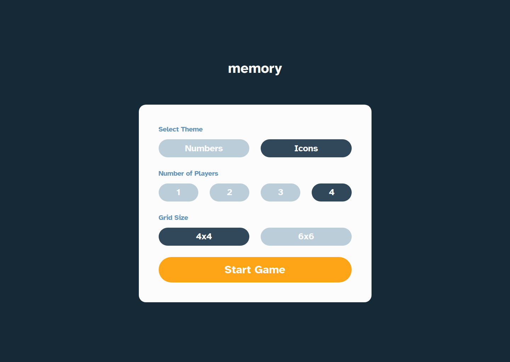
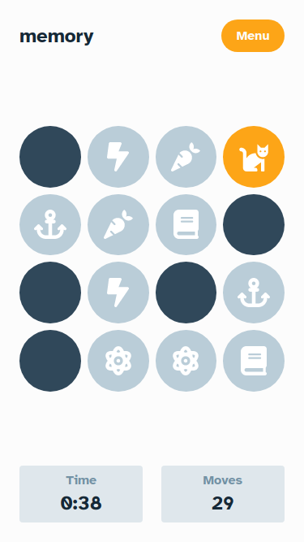

# Frontend Mentor - Memory game solution

## Table of contents

- [Overview](#overview)
- [The challenge](#the-challenge)
- [Screenshot](#screenshot)
- [Built with](#built-with)
- [What I learned](#what-i-learned)
- [Author](#author)

## The challenge

Users should be able to:

View the optimal layout for the game depending on their device's screen size
See hover states for all interactive elements on the page
Play the Memory game either solo or multiplayer (up to 4 players)
Set the theme to use numbers or icons within the tiles
Choose to play on either a 6x6 or 4x4 grid

### Screenshot

;

### Links

- Solution URL: [Memory Game](https://github.com/abderrahmanebnd/memory-game)
- Live Site URL: [Vercel](https://memory-game-sigma-sepia.vercel.app/)

### Built with

- [React](https://reactjs.org/) - JS library
- [TailwindCSS](https://tailwindcss.com/) - For styling
- [Redux](https://redux.js.org/) - State management library for JavaScript apps
- [React Router](https://reactrouter.com/) - Declarative routing for React.js

### What I learned

- Practise more Redux as a global State Manager

## Author

- Website - [abderrahmanebnd](https://github.com/abderrahmanebnd)
- Frontend Mentor - [@abderrahmanebnd](https://www.frontendmentor.io/profile/abderrahmanebnd)
- LinkedIn - [@bendaia_abderrahmane](https://www.linkedin.com/in/bendaia-abderrahmane-80b3a027b/)
- Codepen - [@abderrahmane1110](https://codepen.io/abderrahmane1110)
- CodeWars - [@abderrahmanebnd](https://www.codewars.com/users/abderrahmane1110)
